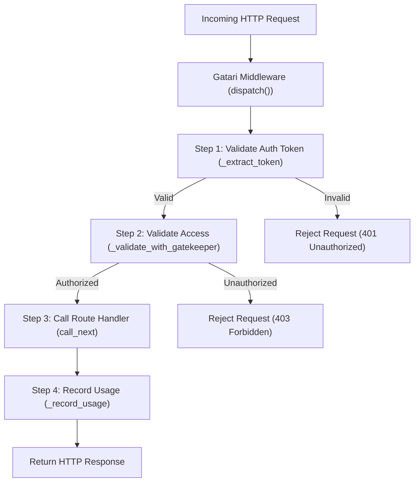

# 🚀 Using Gatari with a Python FastAPI Application

This document describes how Gatari integrates with a FastAPI app using a custom `BaseHTTPMiddleware` to handle **authentication**, **authorization**, and **usage tracking**.

---

## 📊 High-Level Flow

---

## 🧠 Middleware Responsibilities

| Step | Function                      | Purpose                                                                 |
|------|-------------------------------|-------------------------------------------------------------------------|
| 1    | `_extract_token()`            | Validates the JWT and extracts the realm/organization name             |
| 2    | `_validate_with_gatekeeper()` | Sends a request to Gatari’s `/validate` endpoint to authorize access   |
| 3    | `call_next(request)`          | Forwards the request to the route handler if validation is successful  |
| 4    | `_record_usage()`             | Tracks usage by POSTing to Gatari’s `/usage` endpoint                  |

---

## ✅ FastAPI Middleware: Summary

- **Authentication**: Verifies the presence and structure of a bearer token.
- **Authorization**: Delegates access validation to the centralized Gatari service.
- **Accounting**: Sends usage metadata for metering and quota tracking.
- **Context sharing**: Passes decoded token and validation results via `request.state`.